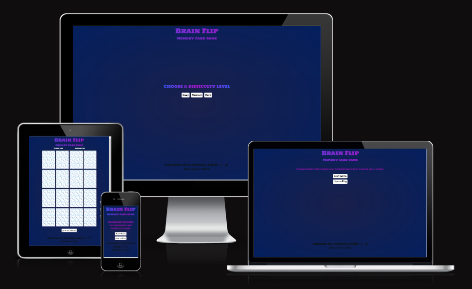

# Brain flip 
Welcome to **Brain Flip**, the online memory card game that will put your memory skills to the test! Challenge yourself by choosing two cards at a time and playing against your memory. This classic game has been adapted for the computer, providing a fair and enjoyable experience to put your skills to the ultimate test.

As a user of this game, you'll be able to rely on your memory to make strategic decisions, and the computer will reveal its random choices to validate your results. Are you up for the challenge? Give it a try and see how well you can match and remember the cards in this exciting game of Brain Flip!

You can view the live site here - <a href="https://patthoege.github.io/brain-flip/" target="_blank" rel="noopener">Brain Flip</a>

## Table of Contents

* [**UX**](<#ux>)
    * [User Stories](#user-stories)
    * [Site Goal](#site-goal)
* [**Design**](<#design>)
  + [Wireframes](#wireframes)
  + [Typography](#typography)
* [**Features**](<#features>)
    * [Start Game](<#start-game>)
    * [Soundtrack Player](<#soundtrack-player>)
    * [Card Flip](<#card-flip>)
    * [Card Match](<#card-match>)
    * [Card Mismatched](<#card-mismatched>)
    * [Timer](<#timer>)
    * [Move Counter](<#move-counter>)
    * [Game Over](<#game-over>)
    * [Win](<#win>)
    * [Button](<#button>)
    * [Footer](<#footer>)
* [**Technologies Used**](<#technologies-used>)
* [**Testing**](<#testing>)
   * [Validator testing](<#validator-testing>)
   * [Manual testing](<#manual-testing>)
   * [Lighthouse testing](<#lighthouse-testing>)
* [**Browser Compatibility**](<#browser-compatibility>)
   * [Browser Testing](<#browser-testing>)
   * [Functionality](<#functionality>)
* [**Bugs**](<#bugs>)
   * [Fixed Bugs](<#bugs>)
* [**Deployment**](<#deployment>)
* [**Credits**](<#credits>)
    * [**Content**](<#content>)
    * [**Frameworks and Code**](<#frameworks-and-code>)
*  [**Acknowledgments**](<#acknowledgments>)

## UX

### User stories
**As a site user, I want to:**

- Site Features Overview: Get a comprehensive overview of the site's features and functionalities.
- Snappy Theme Blurb: Discover a short and captivating description of the site's theme.
- Simple Game Rules: Read a brief and straightforward explanation of the game rule.
- Click Interaction: Play the game with easy-click interactions, including the ability to toggle cards and enjoy exciting sound effects.
- Soundtrack: Experience an exhilarating background music track that intensifies as the game progresses, creating an immersive atmosphere.
- Elapsed Time: Monitor the time that has passed while playing the game.
- Move Counter: Keep track of the number of clicks you perform with a move counter.
- Game Restart: Restart the game without the need to reload the page.
- Footer Information: Easily find the site's creator on social media and GitHub platforms.

[Back to top](<#table-of-contents>)

### Site Goal
The game is designed to match 16 cards within 90 seconds, ensuring a quick and engaging experience for the user. The rules and functionality are kept simple to ensure minimal time is required for learning and understanding.

[Back to top](<#table-of-contents>)

## Design

### Wireframes

The wireframes for the project can be found [here.](/assets/images.readme/BrainFlip%20-%20Framework.pdf)

[Back to top](<#table-of-contents>)

### Typography
 Holtwood One SC is the main font family for the memory card game. Sans Serif, if the mentioned font can't be loaded.

[Back to top](<#table-of-contents>)

## Features

### Start Game 
When clicked, the overlay text will close and the game starts with a running timer and moving counter.

### Soundtrack Player
Once the game begins, an immersive background music sets the tone for the gaming experience.

### Card Flip
When a card is clicked, the card flips over and shows an image. Playing the click sound to provide feedback and engage the user.

### Card Match
Matching card pairs remain face up. Playing the card-matched sound to provide feedback and engage the user.

### Card mismatched
Non-matching cards will flip back after 1,5 seconds.

### Timer
The timer will start running at the start of a game/finish running on game completion.

### Move Counter
The mover counter will increment by 1 each time a card is clicked.

### Game Over
When the time runs up without completing the missing cards, the overlay game over will appear on the screen playing the game over sound and ask to play again. Resetting the time and the moving counter.

### Win
Once found all the matching cards, the overlay you won will appear on the screen playing the winning sound and ask to play again. Resetting the time and the moving counter.

### Button 
When clicked, will reset the time, the moving counter and start the game again while playing the time as well.

### Footer 
At the bottom of the website, you can find the footer section which includes two social network icons for Github, and Linkedin. Finally, at the bottom of the footer, you can find the copyright information.

[Back to top](<#table-of-contents>)

# Technologies Used
* [HTML5](https://en.wikipedia.org/wiki/HTML) - Provides the content and structure for the website.
* [CSS3](https://en.wikipedia.org/wiki/CSS) - Provides the styling for the website.
* [Gitpod](https://www.gitpod.io/) - Used to share and edit the website.
* [Visual Studio Code - VSCode](https://code.visualstudio.com/) - Local editor to edit the website.
* [GitHub](https://github.com/patthoege/brain-flip) - Used to host and deploy the website. 
* [Balsamiq](https://balsamiq.com/ ) - Used to create the wireframes.

[Back to top](<#table-of-contents>)

## Testing
* ## Code Validation

    * The Brain Flip website has been thoroughly tested. All the code has been validated via the [W3C HTML Validator](https://validator.w3.org/), the [W3C CSS Validator](https://jigsaw.w3.org/css-validator/) and [Jshint Validator](http:/jshint.com/). Minor errors were found when tested on [HTML Validation](https://validator.w3.org/) but were fixed immediately and documented below. 

### Validator Testing

<b>W3C HTML Validator Image</b>

 

<b>W3C CSS Validator Image</b>

 

<b>JSHINT Validator Image</b>

 

[Back to top](<#table-of-contents>)

### Lighthouse Testing

<b>Lighthouse Test Index Image</b>

 

[Back to top](<#table-of-contents>)

* ## Browser Compatibility
        
### Browser Testing
* The website has had manual and responsive tests conducted on the below browsers. Ensuring functions are working as expected throughout browsers.

| Browser     | Layout      | Functionality |
| :---------: | :----------:| :-----------: |
| Chrome      | ✔          | ✔             |
| Firefox     | ✔          | ✔             |
| Safari      | ✔          | ✔             |

[Back to top](<#table-of-contents>)

###Functionality
- Testing the complete functionality of the game. This includes:
    - Soundtrack 
    - Game functions 
    - Timer
    - Move Counter

[Back to top](<#table-of-contents>)

# Bugs

## Fixed bugs
1.  The overlay text to start a new game was not displaying after two games. The error was lying at my ready function where I removed the whole game text overlay div when you click on the game over text, so when I call the game over function again the div does not exist anymore which is why it is throwing an error. Instead of using remove child, I hide the div instead to solve the problem.

2. I encountered a problem with the matching sound effect in my game when the player finds two pairs consecutively. The audio for the second pair of matched cards did not play. To address this issue, I sought assistance from a tutor who suggested rewinding the audio effects. In the audioController class, the audio files were not being rewound after being played. Consequently, I made modifications to the pause() method to rectify the problem and ensure proper functionality of the sound effects.

3. To review the last loose ends in developer tools. All the functions appear to be working correctly, but I encountered a browser limitation, due to the async nature of things, in the console when playing the game. The error message is **"Uncaught (in promise) DOMException: The play() request was interrupted by a call to pause()."** I believe this issue is related to how I have implemented the audio pause layout, which is causing conflicts between multiple play/pause requests for an audio element. To address this problem, I sought assistance from a tutor who suggested commenting out all instances of "this.pause()" in the audio code. From my side, even after clearing cache, I still encountered the same problem as described in the **2. paragraph.**  Specifically, the audio for matching cards is not being played after successfully finding two matching pairs in a row, but for the tutor, the audio was working as supposed to. So I only commented *match()* from *this.pause()* **line code : 42** in order to make the sound work.

[Back to top](<#table-of-contents>)

## Deployment

This project was deployed via GitHub Pages and the Gitpod browser, used as a development environment. From here I could commit and push my changes throughout the project.

Steps I took to deploy my website;

- Go to the repository for brain-flip
- Click the Settings tab and locate the Pages tab
- Select to deploy from the main branch
- A few minutes later, upon refreshing the page, my site was live.  

[Back to top](<#table-of-contents>)

# Credits
### Content
* The font came from [Google Fonts](https://fonts.google.com/)
* The icons came from [Font Awesome](https://fontawesome.com/)
* The favicon came from [Icons8](https://icons8.de/icons/set/brain)
* Converter image to png format for better performance from [Convertio](https://convertio.co/) 
* The responsive preview image at the top of the README.md came from [AmIResponsive?](https://ui.dev/amiresponsive?)
* The card pattern image came from [Pattern Monster](https://pattern.monster/)
* The images came from [Pexels](https://www.pexels.com/) and [Freepik](https://www.freepik.com/)
* The text title color came from [Text Gradient Color](https://www.cssportal.com/css-text-gradient-generator/)
* The audio content came from [Open Game Art](https://opengameart.org/art-search?keys=click)

[Back to top](<#table-of-contents>)

### Frameworks and Code
* The website layout draws its inspiration from the Love Maths project. 
* <a href="https://www.w3schools.com/">W3 Schools</a> was a source of help to learn the methods/functions of a card game.
* The <a href="https://www.youtube.com/watch?v=3uuQ3g92oPQ&t=2846s">PortEXE</a> was a very useful resource to learn JavaScript Oriented Object Design Programming.
I research various memory card games from students to gain insights. During this process, I incorporated some of their key illustration points into my own.
* Research further how to shuffle from <a href="https://dev.to/codebubb/how-to-shuffle-an-array-in-javascript-2ikj"> Dev.to</a>
* As I am very new to JS, I asked a developer friend about a better way to approach the code, he recommends to use Javascript classes(Object Oriented Design Pattern) I also did some research about how to use classes to have a more accessible and organized layout of code<a href="https://developer.mozilla.org/en-US/docs/Web/JavaScript/Guide/Using_classes"> JavaScript classes</a> and watch some tutorials.
* https://webtips.dev/memory-game-in-javascript

[Back to top](<#table-of-contents>)

# Acknowledgments
This memory card game was created as part of my Full Stack Software Developer Diploma at the [Code Institute](https://codeinstitute.net/) and serves as my Portfolio Project 2. I am grateful to acknowledge my mentor [Martina Terlević](https://www.linkedin.com/in/martinaterlevic/), the Tutor support, and the entire team at the Code Institute for their assistance and support throughout this process. BrainBlitz has been an invaluable learning experience for me, using the opportunity to gain greater insight into OPP and made me feel great achieving this work that contains the design, user interaction, debugging and deploying a fully functional memory card game.

Patricia Höge 2023.

[Back to top](<#table-of-contents>)